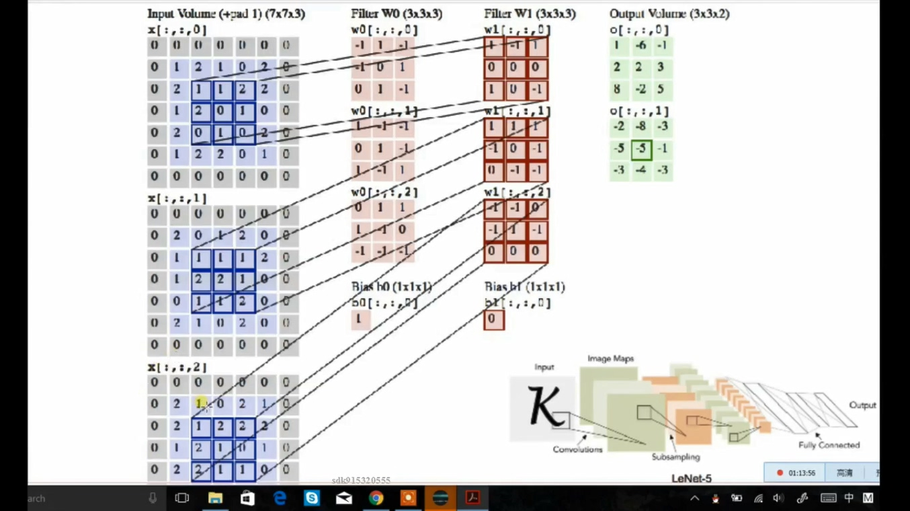

## 图像识别

一张图片是一个二维矩阵

- 图像分类器

  若使用 opencv 特征提取会有问题，难以实现，并且识别的效果受许多因素影响。

- 卷积（卷积核作用：检测图像中和自己相似的部分，值越大则相似度越高）

  zero padding 图片外围拓展一个像素

  

  一张图片 7x7x3 做一个卷积核 3x3x3 的操作，第三维会三个加起来再加一个偏置。**结果 5x5x1**，一个点对应一个卷积结果特征；再经过激活函数，就得到神经元输出。（有n个卷积核做卷积，结果就是 5x5xn）

  一个卷积核操作，得到一张5x5x1图片。

  **卷积核 3x3x3，点积，结果是一个数。**
  $$
  卷积结果图大小=\frac {图像大小-卷积大小}{步长}+1
  $$
  如果除以步长那部分不整除，则需要zero padding

  一个神经元具有一个卷积核。

- 降采样

  pooling 

  在计算机性能不足的时候可以减少计算量，但会损失信息。

- 卷积后是线性的，经过激活函数之后就变成非线性的（所以多层卷积不能合成一层处理）

### 常见网络

#### AlexNet流程(有pooling)(8层)

- ReLU
- Normalization layers
- heavy data augmentation
- dropout 0.5 防止过拟合

- batch size 128 
- SGD Momentum 0.9 随机梯度下降
- learning rate
- L2 weight decay 5e-4
- 7 CNN ensemble 18.2%->15 .4% 识别失败率下降了

#### VGGNet(无pooling)

- 16层
- 19层

#### GoogleNet

- 22层

#### ResNet

- 152层

### tensorflow

为防止过拟合，可以使用 dropout 也可以使用图像**旋转变换**

