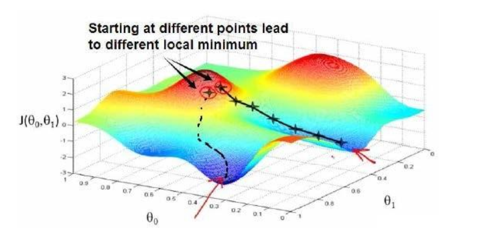

# 引言

## 什么是机器学习

- 监督学习（有正确答案，训练的目的是使得算法更正确地拟合真正的函数）（输入的数据集带有标签）

  例子：房价预测（线性拟合）

  回归问题：房价预测，（函数在连续的输入时，有连续的输出）

  分类问题：性别预测、手写识别，（函数具有离散的输出）

- 无监督学习（数据集不带标签）

  聚类算法（无监督学习的一种）

- 支持向量机（SVN)

  当输入特征太多，数据量太大，内存不够用，使用支持向量机来处理。
  
  

## 单变量线性回归

- 输入的数据集称为训练集
  $$
  h_\theta(x) = \theta_0 + \theta_1x
  $$
  
  只包含一个特征（输入变量），所以称为单变量线性回归

- 代价函数(描述建模的函数和实际函数的差距

  均方误差
$$
J(\theta_0,\theta_1)=\frac 1{2m}\sum_{i=1}^m(h_\theta(x_i)-y_i)^2
$$

  

- 梯度下降

  

$$
\theta_j=\theta_j-\alpha\frac \partial{\partial\theta_j}J(\theta_0,\theta_1)
$$

$ \theta_j $:权重往 J 减少的方向进行变化

$ \alpha $:学习率（走下向山谷的步伐），越大的话，损失 J 下降越快，但不是越大越好（走路步伐太大了会跌倒~~）

- 线性代数

  - 矩阵、向量

    加法、乘法

    求逆、转置