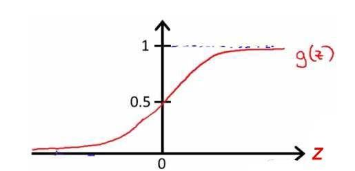
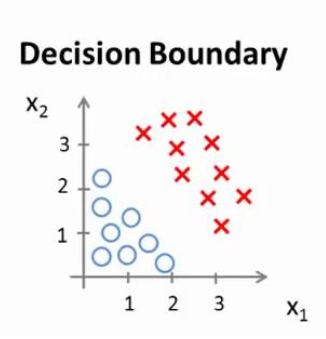
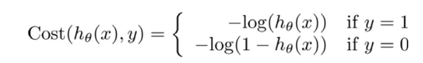
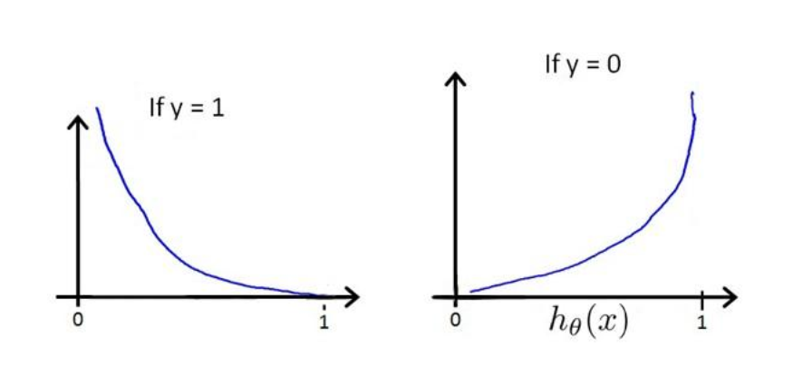
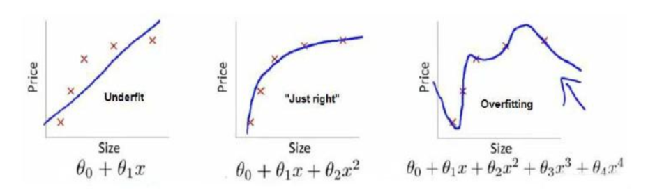

- 分类问题

  二分类：因变量（dependent variable）y 可能属于两个类别（负向类（negative class）、正向类（positive class））。则 y的范围是{0,1}

  回归模型假设：
  $$
  h_\theta(x) =g(\theta^TX)
  $$
  常用的逻辑函数: S型函数 Sigmoid function (激活函数)
  $$
  g(z)=\frac 1{1+e^{-z}}
  $$
  

  0~1表示概率

  sigmoid 的作用：对于输入变量，根据选择的参数，计算出【输出变量】等于1的可能性
  $$
  h_\theta(x)=P(y=1|x;\theta)
  $$
  
- 假说表示

  用一个函数来描述自变量与因变量的关系。

  函数有一个阈值，小于这个阈值时属于一类，超过这个阈值时属于另一类。

- 决策边界（decision boundary）

  对于函数
  $$
  g(z)=\frac 1{1+e^{-z}}
  $$
  z=0 时 g(z)=0.5

  z>0 时 g(z)>0.5

  z<0 时 g(z)<0.5

  z >= 0 时 y = 1 

  z < 0 时 y=0

  

  可以在两组数据之间画一条线，即是决策边界。

  在训练过程中，算法自动调整参数使得决策边界与数据构成的【损失函数】“最小化”，最后得出一条决策边界，对应有最佳权重。

  在测试时，使用训练好的权重进行预测。

- 代价函数  cost function（损失函数 loss function）
  $$
  J(\theta)=\frac 1m \sum_{i=1}^mCost(h_\theta(x^{(i)},y^{(i)})
  $$
  

  

  上图中， y 是真实值（输入），h_theta 是预测值，纵轴是损失值（loss）。 

- 多类别分类

#### 正则化

- 过拟合

  

  （1）欠拟合。（训练次数少）

  （2）适当的拟合。

  （3）过拟合。数据量少，训练次数过多。（解决的方法是增加数据量，或减少训练次数。如果数量量本来就少，说明是数据量的问题。）

  过拟合问题的解决：

  1、模型选择的算法（如 PCA ）丢弃一些对正确预测没有帮助的特征。

  2、正则化。保留所有特征，但是减少参数的大小。

- 代价函数

  代价函数中加入正则化项
  $$
  \lambda\sum_{j=1}^n\theta^2_j
  $$
  lambda ：正则化参数

