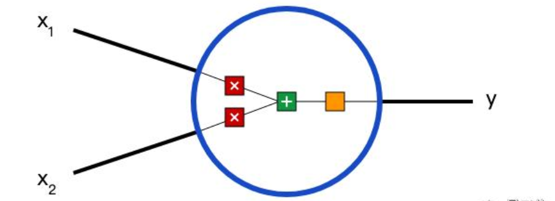
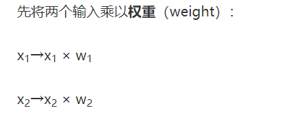
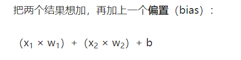
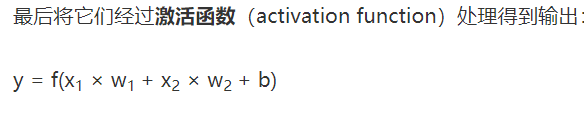
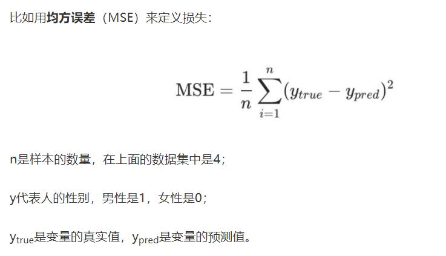
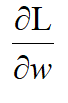

神经元的运算原理以及基本神经网络的搭建







- 前向传递就是做内积运算，输入x 和权重w的内积加上一个偏置bias

  

- 损失是用来描述预测值和实际值的偏差程度。

  

- 损失函数:L(w1,w2,w3,w4,w5,w6,b1,b2,b3)
  
  训练的y原理：w1,w2,w3,w4,w5,w6,b1,b2,b3 的改变会引起L的改变，所以，要使得各个参数往L减少的方向变化。而L对各个参数的偏导就反映了参数变化与L变化的关系，所以比如对于权重 w1 选定一个 值之后 算出偏导，就知道了 w1 的变化会引起 L 往哪个方向变化，所以 w1 可以提前减去这个变化，使得 L 减小，同样地，其他参数也是这样的道理。一次计算，这9个参数就往L减少的方向靠近一些，随着迭代次数增加，这L就会减少到接近0，最终得到一组9个参数，就是训练的结果。
  
  在训练过程中，网络中的参数是对“正确函数的参数”的趋近，各个参数都想往使得预测的更艰难接近正确，但各个参数之间很可能会发生冲突，就使得了训练的过程是曲折的。
  
  代码演示
  
  ```python
  import matplotlib.pyplot as plt
  import numpy as np
  
  
  # sigmoid
  def sigmoid(x):
      return 1 / (1 + np.exp(-x))
  
  
  def deriv_sigmoid(x):
      fx = sigmoid(x)
      return fx * (1 - fx)
  
  
  # mse 损失函数
  def mse_lose(y_true, y_pred):
      # y_true and ypred are 'numpy arrays'
      return ((y_true - y_pred) ** 2).mean()  # (y1-y2)的(逐项差)平方，求和，取平均值（mean）
  
  
  class OurNeutonNetwork:
      '''
      - 2 input
      - a hiden layer with 2 neuron (h1, h2)
      - an output layer with 1 neuron(o1)
      '''
  
      def __init__(self):
          # Weights
          self.w1 = np.random.normal()
          self.w2 = np.random.normal()
          self.w3 = np.random.normal()
          self.w4 = np.random.normal()
          self.w5 = np.random.normal()
          self.w6 = np.random.normal()
  
          # Biases
          self.b1 = np.random.normal()
          self.b2 = np.random.normal()
          self.b3 = np.random.normal()
          self.loss_array = np.array([])
          self.epoch_array = np.array([])
  
      def feedForward(self, x):
          h1 = sigmoid(self.w1 * x[0] + self.w2 * x[1] + self.b1)
          h2 = sigmoid(self.w3 * x[0] + self.w4 * x[1] + self.b2)
          o1 = sigmoid(self.w5 * h1 + self.w6 * h2 + self.b3)
          return o1
  
      def train(self, data, all_y_trues):
          '''
          :param data:(n x 2)numpy array
          :param all_y_trues:a numpy array with n elements
          :return:
          '''
          learn_rate = 8
          epochs = 1000
  
          for epoch in range(epochs):
              for x, y_true in zip(data, all_y_trues):
                  sum_h1 = self.w1 * x[0] + self.w2 * x[1] + self.b1
                  h1 = sigmoid(sum_h1)  # h1的输出
                  sum_h2 = self.w3 * x[0] + self.w4 * x[1] + self.b2
                  h2 = sigmoid(sum_h2)
                  sum_o1 = self.w5 * h1 + self.w6 * h2 + self.b3
                  o1 = sigmoid(sum_o1)
                  y_pred = o1
                  d_L_d_ypred = -2 * (y_true - y_pred)
  
                  # --calculate partial derivative
                  # neuron o1
                  d_ypred_d_w5 = h1 * deriv_sigmoid(sum_o1)
                  d_ypred_d_w6 = h2 * deriv_sigmoid(sum_o1)
                  d_ypred_d_b3 = deriv_sigmoid(sum_o1)
                  d_ypred_d_h1 = self.w5 * deriv_sigmoid(sum_o1)
                  d_ypred_d_h2 = self.w6 * deriv_sigmoid(sum_o1)
                  # neuron h1
                  d_h1_d_w1 = x[0] * deriv_sigmoid(sum_h1)
                  d_h1_d_w2 = x[1] * deriv_sigmoid(sum_h1)
                  d_h1_d_b1 = deriv_sigmoid(sum_h1)
                  # Neuron h2
                  d_h2_d_w3 = x[0] * deriv_sigmoid(sum_h2)
                  d_h2_d_w4 = x[1] * deriv_sigmoid(sum_h2)  # 输入*微分
                  d_h2_d_b2 = deriv_sigmoid(sum_h2)
  
                  # Update weights and biases
                  self.w1 -= learn_rate * d_L_d_ypred * d_ypred_d_h1 * d_h1_d_w1
                  self.w2 -= learn_rate * d_L_d_ypred * d_ypred_d_h1 * d_h1_d_w2
                  self.b1 -= learn_rate * d_L_d_ypred * d_ypred_d_h1 * d_h1_d_b1
  
                  self.w3 -= learn_rate * d_L_d_ypred * d_ypred_d_h2 * d_h2_d_w3
                  self.w4 -= learn_rate * d_L_d_ypred * d_ypred_d_h2 * d_h2_d_w4
                  self.b2 -= learn_rate * d_L_d_ypred * d_ypred_d_h2 * d_h2_d_b2
  
                  self.w5 -= learn_rate * d_L_d_ypred * d_ypred_d_w5
                  self.w6 -= learn_rate * d_L_d_ypred * d_ypred_d_w6
                  self.b3 -= learn_rate * d_L_d_ypred * d_ypred_d_b3
  
                  if epoch % 10 == 0:
                      y_preds = np.apply_along_axis(self.feedForward,1,data)
                      loss = mse_lose(all_y_trues,y_preds)
                      self.loss_array = np.append(self.loss_array,loss)
                      self.epoch_array = np.append(self.epoch_array,epoch)
                      print("epoch %d loss:%.3f"%(epoch,loss))
  
  data = np.array([
      [-2,-1],
      [25,6],
      [17,4],
      [-15,-6]
  ])
  all_y_true =np.array([
      1,0,0,1
  ])
  network = OurNeutonNetwork()
  network.train(data,all_y_true)
  emily = np.array([-136,2.9])
  frank = np.array([6,3.3])
  print("Emily %.3f"%network.feedForward(emily))
  print("Frank %.3f"%network.feedForward(frank))
  print(network.loss_array)
  print(network.epoch_array.size)
  plt.plot(network.epoch_array,network.loss_array)
  plt.show()
  ```
  
  

$$
y=(x_1 .w_1)+(x_2.w_2)+b
$$

